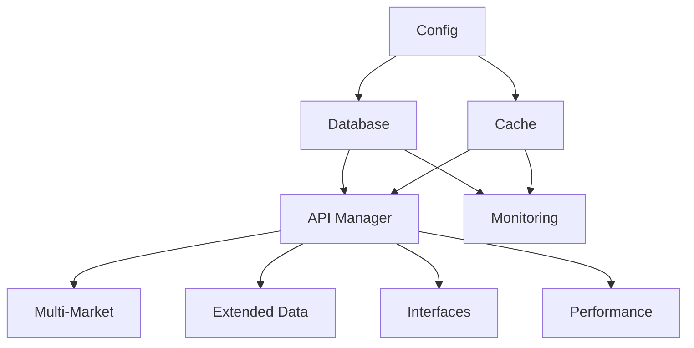

# SimTradeData 开发者指南

## 📖 概述

本指南面向希望参与SimTradeData开发、扩展功能或集成到自己项目中的开发者。涵盖了项目架构、开发环境搭建、代码规范、测试指南和贡献流程。

## 🏗️ 项目架构

### 整体架构

SimTradeData 采用分层模块化架构：

```
SimTradeData
├── 数据层 (Data Layer)
│   ├── 数据库管理 (Database)
│   ├── 缓存管理 (Cache)
│   └── 数据源 (Data Sources)
├── 业务层 (Business Layer)
│   ├── API管理 (API Manager)
│   ├── 多市场管理 (Multi-Market)
│   ├── 扩展数据 (Extended Data)
│   └── 数据预处理 (Preprocessor)
├── 接口层 (Interface Layer)
│   ├── PTrade适配器 (PTrade Adapter)
│   ├── REST API (REST Server)
│   └── API网关 (API Gateway)
├── 性能层 (Performance Layer)
│   ├── 查询优化 (Query Optimizer)
│   ├── 并发处理 (Concurrent Processor)
│   └── 性能监控 (Performance Monitor)
└── 监控层 (Monitoring Layer)
    ├── 系统监控 (System Monitor)
    ├── 日志管理 (Log Manager)
    ├── 健康检查 (Health Checker)
    └── 运维工具 (Ops Tools)
```

### 核心设计原则

1. **模块化**: 每个模块职责单一，接口清晰
2. **可扩展**: 支持插件式扩展新功能
3. **高性能**: 多级缓存、并发处理、查询优化
4. **可靠性**: 错误处理、健康检查、自动恢复
5. **可观测**: 全面监控、日志记录、性能分析

### 依赖关系



## 🛠️ 开发环境搭建

### 环境要求

- Python 3.8+
- Poetry (包管理)
- SQLite 3.x
- Git

### 安装步骤

1. **克隆项目**
```bash
git clone <repository-url>
cd SimTradeLab
```

2. **安装Poetry**
```bash
curl -sSL https://install.python-poetry.org | python3 -
```

3. **安装依赖**
```bash
poetry install --with dev
```

4. **激活虚拟环境**
```bash
poetry shell
```

5. **运行测试**
```bash
poetry run pytest
```

### 开发工具配置

#### VS Code配置

创建 `.vscode/settings.json`:
```json
{
    "python.defaultInterpreterPath": ".venv/bin/python",
    "python.linting.enabled": true,
    "python.linting.pylintEnabled": true,
    "python.formatting.provider": "black",
    "python.testing.pytestEnabled": true,
    "python.testing.pytestArgs": ["tests/"]
}
```

#### Pre-commit钩子

```bash
# 安装pre-commit
poetry add --group dev pre-commit

# 安装钩子
pre-commit install
```

创建 `.pre-commit-config.yaml`:
```yaml
repos:
  - repo: https://github.com/psf/black
    rev: 22.3.0
    hooks:
      - id: black
  - repo: https://github.com/pycqa/isort
    rev: 5.10.1
    hooks:
      - id: isort
  - repo: https://github.com/pycqa/flake8
    rev: 4.0.1
    hooks:
      - id: flake8
```

## 📝 代码规范

### Python代码风格

遵循PEP 8规范，使用Black格式化工具：

```python
# 好的示例
class DataManager:
    """数据管理器类"""
    
    def __init__(self, config: Config):
        """初始化数据管理器"""
        self.config = config
        self.cache = {}
    
    def get_data(self, symbol: str, start_date: str, end_date: str) -> pd.DataFrame:
        """获取数据"""
        cache_key = f"{symbol}_{start_date}_{end_date}"
        
        if cache_key in self.cache:
            return self.cache[cache_key]
        
        # 从数据库获取数据
        data = self._fetch_from_database(symbol, start_date, end_date)
        self.cache[cache_key] = data
        
        return data
    
    def _fetch_from_database(self, symbol: str, start_date: str, end_date: str) -> pd.DataFrame:
        """从数据库获取数据（私有方法）"""
        # 实现细节
        pass
```

### 命名规范

- **类名**: PascalCase (如 `DataManager`)
- **函数名**: snake_case (如 `get_data`)
- **变量名**: snake_case (如 `cache_key`)
- **常量名**: UPPER_SNAKE_CASE (如 `DEFAULT_TTL`)
- **私有方法**: 前缀下划线 (如 `_fetch_from_database`)

### 文档字符串

使用Google风格的文档字符串：

```python
def get_stock_data(symbol: str, start_date: str, end_date: str) -> pd.DataFrame:
    """获取股票数据
    
    Args:
        symbol: 股票代码，如'000001.SZ'
        start_date: 开始日期，格式'YYYY-MM-DD'
        end_date: 结束日期，格式'YYYY-MM-DD'
    
    Returns:
        包含股票数据的DataFrame
    
    Raises:
        ValueError: 当日期格式不正确时
        DatabaseError: 当数据库连接失败时
    
    Example:
        >>> data = get_stock_data('000001.SZ', '2024-01-01', '2024-01-31')
        >>> print(data.head())
    """
    pass
```

### 类型注解

使用类型注解提高代码可读性：

```python
from typing import Dict, List, Optional, Union
import pandas as pd

def process_data(
    data: pd.DataFrame,
    config: Dict[str, Any],
    symbols: Optional[List[str]] = None
) -> Union[pd.DataFrame, None]:
    """处理数据"""
    pass
```

## 🧪 测试指南

### 测试结构

```
tests/
├── unit/                 # 单元测试
│   ├── test_database.py
│   ├── test_cache.py
│   └── test_api.py
├── integration/          # 集成测试
│   ├── test_api_integration.py
│   └── test_multi_market.py
├── performance/          # 性能测试
│   └── test_performance.py
├── fixtures/             # 测试数据
│   └── sample_data.py
└── conftest.py          # pytest配置
```

### 编写单元测试

```python
import pytest
import pandas as pd
from unittest.mock import Mock, patch
from simtradedata.api import APIManager

class TestAPIManager:
    """API管理器测试"""
    
    @pytest.fixture
    def mock_db_manager(self):
        """模拟数据库管理器"""
        return Mock()
    
    @pytest.fixture
    def mock_cache_manager(self):
        """模拟缓存管理器"""
        return Mock()
    
    @pytest.fixture
    def api_manager(self, mock_db_manager, mock_cache_manager):
        """API管理器实例"""
        from simtradedata.config import Config
        config = Config()
        return APIManager(mock_db_manager, mock_cache_manager, config)
    
    def test_get_daily_data_success(self, api_manager, mock_db_manager):
        """测试获取日线数据成功"""
        # 准备测试数据
        expected_data = pd.DataFrame({
            'symbol': ['000001.SZ'],
            'trade_date': ['2024-01-20'],
            'close': [10.5]
        })
        mock_db_manager.fetchall.return_value = expected_data.to_dict('records')
        
        # 执行测试
        result = api_manager.get_daily_data('000001.SZ', '2024-01-20', '2024-01-20')
        
        # 验证结果
        assert len(result) == 1
        assert result.iloc[0]['symbol'] == '000001.SZ'
        assert result.iloc[0]['close'] == 10.5
    
    def test_get_daily_data_cache_hit(self, api_manager, mock_cache_manager):
        """测试缓存命中"""
        # 设置缓存返回数据
        cached_data = pd.DataFrame({'symbol': ['000001.SZ'], 'close': [10.5]})
        mock_cache_manager.get.return_value = cached_data
        
        # 执行测试
        result = api_manager.get_daily_data('000001.SZ', '2024-01-20', '2024-01-20')
        
        # 验证缓存被调用
        mock_cache_manager.get.assert_called_once()
        assert len(result) == 1
    
    @patch('simtradedata.api.logger')
    def test_get_daily_data_error_handling(self, mock_logger, api_manager, mock_db_manager):
        """测试错误处理"""
        # 模拟数据库错误
        mock_db_manager.fetchall.side_effect = Exception("Database error")
        
        # 执行测试
        result = api_manager.get_daily_data('000001.SZ', '2024-01-20', '2024-01-20')
        
        # 验证错误处理
        assert result.empty
        mock_logger.error.assert_called_once()
```

### 集成测试

```python
import pytest
import tempfile
from pathlib import Path
from simtradedata.database import DatabaseManager
from simtradedata.cache import CacheManager
from simtradedata.api import APIManager
from simtradedata.config import Config

class TestAPIIntegration:
    """API集成测试"""
    
    @pytest.fixture
    def temp_db(self):
        """临时数据库"""
        with tempfile.NamedTemporaryFile(suffix='.db', delete=False) as f:
            yield f.name
        Path(f.name).unlink(missing_ok=True)
    
    @pytest.fixture
    def integration_setup(self, temp_db):
        """集成测试设置"""
        config = Config()
        config.set('database.path', temp_db)
        
        db_manager = DatabaseManager(config)
        db_manager.connect()
        
        cache_manager = CacheManager(config)
        api_manager = APIManager(db_manager, cache_manager, config)
        
        yield api_manager, db_manager, cache_manager
        
        db_manager.close()
    
    def test_full_data_workflow(self, integration_setup):
        """测试完整数据流程"""
        api_manager, db_manager, cache_manager = integration_setup
        
        # 1. 存储数据
        test_data = pd.DataFrame({
            'symbol': ['000001.SZ'],
            'trade_date': ['2024-01-20'],
            'open': [10.0],
            'high': [10.5],
            'low': [9.8],
            'close': [10.2],
            'volume': [1000000]
        })
        
        success = api_manager.store_daily_data(test_data)
        assert success
        
        # 2. 获取数据（第一次，从数据库）
        result1 = api_manager.get_daily_data('000001.SZ', '2024-01-20', '2024-01-20')
        assert len(result1) == 1
        assert result1.iloc[0]['close'] == 10.2
        
        # 3. 获取数据（第二次，从缓存）
        result2 = api_manager.get_daily_data('000001.SZ', '2024-01-20', '2024-01-20')
        assert len(result2) == 1
        assert result2.iloc[0]['close'] == 10.2
        
        # 4. 验证数据一致性
        pd.testing.assert_frame_equal(result1, result2)
```

### 性能测试

```python
import time
import pytest
from simtradedata.performance import ConcurrentProcessor

class TestPerformance:
    """性能测试"""
    
    def test_concurrent_processing_performance(self):
        """测试并发处理性能"""
        processor = ConcurrentProcessor()
        
        def cpu_intensive_task(n):
            """CPU密集型任务"""
            return sum(i * i for i in range(n))
        
        # 串行执行
        start_time = time.time()
        serial_results = [cpu_intensive_task(1000) for _ in range(10)]
        serial_time = time.time() - start_time
        
        # 并行执行
        start_time = time.time()
        args_list = [(1000,) for _ in range(10)]
        parallel_results = processor.execute_parallel(cpu_intensive_task, args_list)
        parallel_time = time.time() - start_time
        
        # 验证结果正确性
        assert serial_results == parallel_results
        
        # 验证性能提升
        speedup = serial_time / parallel_time
        assert speedup > 1.5  # 至少1.5倍性能提升
        
        processor.stop_workers()
    
    @pytest.mark.benchmark
    def test_cache_performance(self, benchmark):
        """测试缓存性能"""
        from simtradedata.cache import CacheManager
        cache_manager = CacheManager()
        
        def cache_operations():
            # 设置1000个缓存项
            for i in range(1000):
                cache_manager.set(f"key_{i}", f"value_{i}")
            
            # 获取1000个缓存项
            for i in range(1000):
                cache_manager.get(f"key_{i}")
        
        # 基准测试
        result = benchmark(cache_operations)
        assert result is None  # 函数无返回值
```

### 运行测试

```bash
# 运行所有测试
poetry run pytest

# 运行特定测试文件
poetry run pytest tests/test_api.py

# 运行特定测试类
poetry run pytest tests/test_api.py::TestAPIManager

# 运行特定测试方法
poetry run pytest tests/test_api.py::TestAPIManager::test_get_daily_data_success

# 运行测试并生成覆盖率报告
poetry run pytest --cov=simtradedata --cov-report=html

# 运行性能测试
poetry run pytest -m benchmark

# 运行集成测试
poetry run pytest tests/integration/
```

## 🔧 扩展开发

### 添加新的数据源

1. **创建数据源类**

```python
# simtradedata/data_sources/custom_source.py
from .base import DataSource
import pandas as pd

class CustomDataSource(DataSource):
    """自定义数据源"""
    
    def __init__(self, config):
        super().__init__(config)
        self.api_key = config.get('custom_source.api_key')
    
    def get_daily_data(self, symbol: str, start_date: str, end_date: str) -> pd.DataFrame:
        """获取日线数据"""
        # 实现数据获取逻辑
        pass
    
    def get_stock_list(self, market: str = None) -> pd.DataFrame:
        """获取股票列表"""
        # 实现股票列表获取逻辑
        pass
    
    def test_connection(self) -> bool:
        """测试连接"""
        # 实现连接测试逻辑
        pass
```

2. **注册数据源**

```python
# simtradedata/data_sources/__init__.py
from .custom_source import CustomDataSource

# 在DataSourceManager中注册
def register_custom_sources(manager):
    manager.register_source('custom', CustomDataSource)
```

3. **配置数据源**

```python
config.set('data_sources.custom.enabled', True)
config.set('data_sources.custom.api_key', 'your_api_key')
```

### 添加新的接口

1. **创建接口类**

```python
# simtradedata/interfaces/grpc_server.py
import grpc
from concurrent import futures
from .base import BaseInterface

class GRPCServer(BaseInterface):
    """gRPC服务器"""
    
    def __init__(self, api_manager, config):
        super().__init__(api_manager, config)
        self.server = None
    
    def start(self):
        """启动服务器"""
        self.server = grpc.server(futures.ThreadPoolExecutor(max_workers=10))
        # 添加服务
        self.server.add_insecure_port(f"[::]:{self.config.get('grpc.port', 50051)}")
        self.server.start()
    
    def stop(self):
        """停止服务器"""
        if self.server:
            self.server.stop(0)
```

2. **实现服务方法**

```python
# 定义protobuf服务
# stock_service.proto
syntax = "proto3";

service StockService {
    rpc GetStockData(StockRequest) returns (StockResponse);
}

message StockRequest {
    string symbol = 1;
    string start_date = 2;
    string end_date = 3;
}

message StockResponse {
    repeated StockData data = 1;
}

message StockData {
    string symbol = 1;
    string trade_date = 2;
    double close = 3;
}
```

### 添加新的监控指标

1. **创建自定义收集器**

```python
# simtradedata/monitoring/custom_collector.py
from .base import MetricCollector

class CustomMetricCollector(MetricCollector):
    """自定义指标收集器"""
    
    def collect_metrics(self) -> Dict[str, float]:
        """收集自定义指标"""
        return {
            'custom_metric_1': self._get_custom_metric_1(),
            'custom_metric_2': self._get_custom_metric_2(),
        }
    
    def _get_custom_metric_1(self) -> float:
        """获取自定义指标1"""
        # 实现指标收集逻辑
        pass
```

2. **注册收集器**

```python
from simtradedata.monitoring import PerformanceMonitor

monitor = PerformanceMonitor()
monitor.add_custom_collector('custom', CustomMetricCollector())
```

## 🚀 部署指南

### 生产环境配置

```python
# production_config.py
from simtradedata.config import Config

def create_production_config():
    config = Config()
    
    # 数据库配置
    config.set('database.path', '/data/simtradedata.db')
    config.set('database.pool_size', 20)
    config.set('database.timeout', 60)
    
    # 缓存配置
    config.set('cache.ttl', 300)
    config.set('cache.max_size', 10000)
    
    # API配置
    config.set('api.host', '0.0.0.0')
    config.set('api.port', 8080)
    config.set('api.workers', 4)
    
    # 监控配置
    config.set('monitoring.enable', True)
    config.set('monitoring.retention_days', 30)
    
    # 日志配置
    config.set('logging.level', 'INFO')
    config.set('logging.file', '/var/log/simtradedata.log')
    
    return config
```

### Docker部署

```dockerfile
# Dockerfile
FROM python:3.9-slim

WORKDIR /app

# 安装系统依赖
RUN apt-get update && apt-get install -y \
    gcc \
    && rm -rf /var/lib/apt/lists/*

# 安装Python依赖
COPY pyproject.toml poetry.lock ./
RUN pip install poetry && \
    poetry config virtualenvs.create false && \
    poetry install --only=main

# 复制应用代码
COPY simtradedata/ ./simtradedata/
COPY examples/ ./examples/

# 创建数据目录
RUN mkdir -p /data /var/log

# 暴露端口
EXPOSE 8080

# 启动应用
CMD ["python", "-m", "simtradedata.server"]
```

```yaml
# docker-compose.yml
version: '3.8'

services:
  ptrade-cache:
    build: .
    ports:
      - "8080:8080"
    volumes:
      - ./data:/data
      - ./logs:/var/log
    environment:
      - PTRADE_CONFIG_FILE=/app/production_config.py
    restart: unless-stopped
    
  nginx:
    image: nginx:alpine
    ports:
      - "80:80"
    volumes:
      - ./nginx.conf:/etc/nginx/nginx.conf
    depends_on:
      - ptrade-cache
    restart: unless-stopped
```

## 🤝 贡献指南

### 贡献流程

1. **Fork项目**
2. **创建功能分支**: `git checkout -b feature/new-feature`
3. **提交更改**: `git commit -am 'Add new feature'`
4. **推送分支**: `git push origin feature/new-feature`
5. **创建Pull Request**

### 代码审查

所有代码更改都需要通过代码审查：

- 代码风格符合项目规范
- 包含适当的测试
- 文档更新完整
- 性能影响评估
- 安全性检查

### 发布流程

1. **版本号管理**: 使用语义化版本控制
2. **变更日志**: 更新CHANGELOG.md
3. **标签发布**: `git tag v1.0.0`
4. **自动化测试**: CI/CD流水线验证
5. **文档更新**: 同步更新文档

---

*SimTradeData Developer Guide - 开发者完整指南*
